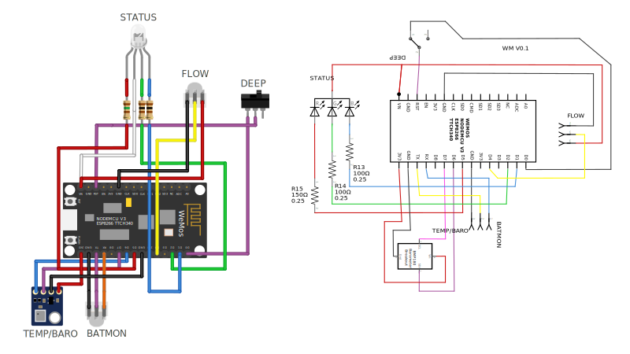
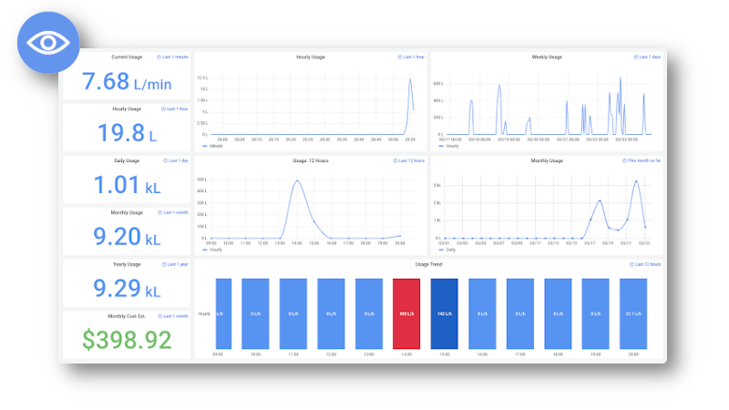
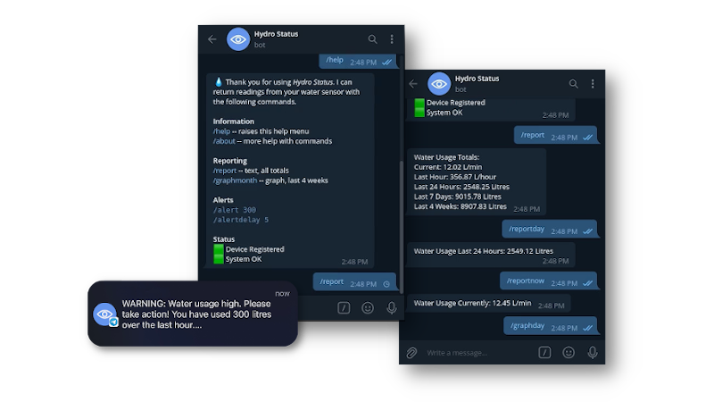
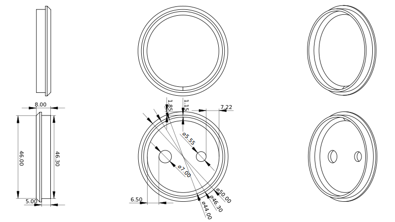
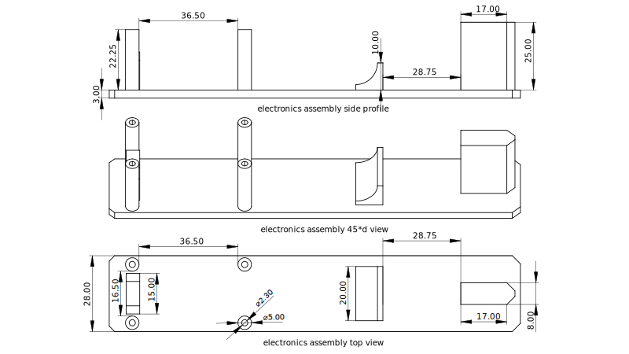
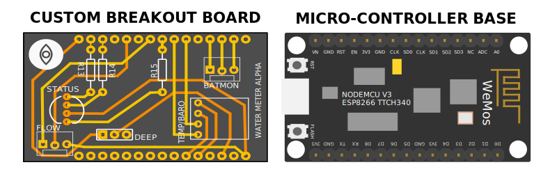

<div id="top"></div>

<!-- PROJECT LOGO -->
<br />

<div align="center">
  

  <h3 align="center">HYDRO STATUS</h3>

  <p align="center">
    A water usage logger
    <br />
    <a href="https://youtu.be/hqjcAQJdR2c">View Demo Video</a>
  </p>
</div>

</br>

## __Summary__

For my __Harvard CS50__ final project, I set out to create a __hardware application__ that continuously logs mains __water usage__ to a __database__ using a __micro-controller__ and a __flow sensor__. The time-series data is then graphed by a __dashboard__ and monitored by a __notification system__ that sends out __alerts__ when the water usage is too high.

#### __Video Demo__
<div align="center">
<video width="850" controls>
  <source src="readme/video/hydrostatus_harvardcs50.ogv">
</video>
</div>

### __Motivation__

The reason for choosing this project was to help solve a simple problem. I live in a desert climate where water is precious and burst water pipes are a common occurrence, so I set out to find a way to measure and report on our home's water usage to help save water, and reduce water bills. 

### __Features__

The defining features of this project are:

* ♻️ __continuous__: real-time recording and reporting of water usage
* 📊 __metrics__: stores historical usage and and presents it through a dashboard
* 🚨 __notifications__: tracks high usage and sends alerts via a chat application
* 📲 __interactive__: users can query the system for information and set alerts

### __Outcomes__

The scope of the project is guided by the following goals. I will try to work towards reaching these goals within the time I have alloted myself to complete the project and will consider the project a success if I am able to deliver on the 'better' goals.

* __good__:
  * <span style="color:green">\[DONE\]</span> Collect sensor data, push that sensor data to a server hosting a database
  * <span style="color:green">\[DONE\]</span> Read the sensor data from the database and display those metrics on a dashboard
  * <span style="color:green">\[DONE\]</span> Have the system warn the user with a high usage alarm via messaging app
* __better__:
  * <span style="color:green">\[DONE\]</span> Have the system automatically report usage on a weekly and monthly schedule
  * <span style="color:green">\[DONE\]</span> Be able to interactively query the system through a messaging app
  * <span style="color:green">\[DONE\]</span> Have the system passively report its status with a RGB LED
* __best__:
  * <span style="color:green">\[DONE\]</span> Implement a hardware key as basic security
  * <span style="color:orange">\[IN-PROGRESS\]</span> Automate deployment of the software stack with containers
  * <span style="color:orange">\[DESIGNED\]</span> Design a custom breakout board to streamline hardware assembly
  * <span style="color:orange">\[TESTED\]</span> Make the project solar powered but retain continuous, or near real-time operation

<sub>For more information see: <a href="https://cs50.harvard.edu/x/2022/project/">Harvard CS50 final project</a>.</sub>

### __Methodology__

</br>

<div align="center">
  
</div>

</br>

I chose to use __InfluxDB__ as the datastore for this project because of how integrated it is in __Grafana__ and well suited it is for time-series data in general. The compiling and flashing of programs to the micro-controller is managed through the __Arduino IDE__. I opted to push sensor data directly from the micro-controller to the locally hosted database using a library called __InfluxDBClient__. The local instance of Grafana, InfluxDB and the __Python notification system__ are hosted as __Docker containers__ on a __Raspberry Pi__ running __Dietpi__, a Linux distribution based on Debian with a small memory footprint.

I decided to use Docker because of ease of deployment. I also make use of __Telegram's Bot API__ and the __Python Telegram Bot library__ to push notifications from the server to the user's mobile device. The notification system makes use of __Requests__ to get __InfluxQL__ queries from the InfluxDB database using the __InfluxDBClient__ library and then transform those queries with __Pandas__ into dataframes that can be plotted by __MatPlotLib__.

---

## __Components__

The following electronic components were sourced for this project:

<div align="center">
  
</div>

> Layout needs to be updated: flow sensor no longer requires 5v+ from vn, now runs 3.3v+

* __Micro-Controller__ - 1 X WeMos NodeMCU V3 ESP8266* TTCH340
* __Sensor__ - 1 X YF-B10 Turbine Flow Sensor, DN25, 2-50 L/min, Frequency: 6*Q-8 = l/min
* __Buck-Converter__ - 1 X DC-DC, 12v-5v
* __Photovoltaic Cells__ - 3 X Monocrystalline, in series, 1W 5V, 60x110mm
* __Charge-Controller__ - 1 X XY-L10A, Overcharge Protection, Digital Reporting
* __Battery__ - 1 X Reclaimed, Sealed Lead-Acid, 12v 7aH
* __LED__ - 1 X 10mm Common Anode Diffused RGB LED
* __Ressitors__ - 5 X 100 Ohm resistors

<sub>* See <a href="https://arduino-esp8266.readthedocs.io/">esp8266 documentation</a> and <a href="https://github.com/nodemcu/nodemcu-devkit-v1.0">modemcu-devkit</a> for more information.</sub>

### __Flow Rate Calculations__

To calculate the __Flow Rate__ of the fluid through the sensor we need to read the flow sensors __Pulse Frequency__ and divide those pulses by the sensors __Calibration Factor__.

The calibration factor for this sensor is __6 * Q - 8__. Where __Q__ is flow rate in L/min. The Formula for L/min then is __((pulses + 8) / 6)__. While calibrating the sensor manually, I found __((pulses + 3) / 6)__ gave more accurate results.

```c
flow_rate = ((1000.0 / (millis() - ms_previous)) * (pulses_sec + 3)) / 6;
```

### __Notes__

```md
15-02-22 - I was unable to find 150 Ohm resistors so I put two 100 Ohm resistors in parallel giving me a 50 Ohm resistor and placed this new 50 Ohm resistor in series with a 100 Ohm resistor to make 150 Ohm needed for the red channel of the RGB led to function at 5V+.

01-03-22 - Unfortunately the micro-controller I was using at the start of the project developed an electrical fault, causing a 1N5819 Schottky Diode to fail.

04-03-22 - I have managed to revive the micro-controller by bypassing the Schottky diode. This is a temporary solution until I can get components or a new controller.
```

---

## __InfluxDB Database__

>🟩 STATUS: DONE.

For the database I opted to use a downsampling and retention policy that doesn't put too much stress on the Raspberry Pi's limited memory and CPU cycles. The default policy retains the raw data for a maximum of 1 week after which it resamples the data in order to reduce the number of data points but retain meaningful time series information. 

### __Database Setup__
```sql
# Create admin and password
CREATE USER admin WITH PASSWORD "admin-password" WITH ALL PRIVILEGES

# Create user and password
CREATE USER username WITH PASSWORD "user-password"

# Create database
CREATE DATABASE watermeter

# Grant user privileges on database
GRANT ALL ON watermeter TO username

# Select the database for use
USE watermeter

# Create measurements and tags
# flowrate -- Flow in litres per minute (instantaneous)
# usage -- Usage in litres per second (periodical)
INSERT water,sensor=flowsensor flowrate=0,usage=0
```

### __Create Retention Policies__
```sql
CREATE RETENTION POLICY "retainweek" ON "watermeter" DURATION 1w REPLICATION 1 DEFAULT

CREATE RETENTION POLICY "retainmonth" ON "watermeter" DURATION 4w REPLICATION 1

CREATE RETENTION POLICY "retainhalfyear" ON "watermeter" DURATION 24w REPLICATION 1

CREATE RETENTION POLICY "retainyear" ON "watermeter" DURATION 52w REPLICATION 1
```

### __Create Continuous Queries__
```sql
CREATE CONTINUOUS QUERY "minute" ON "watermeter" BEGIN SELECT sum("usage") AS "1m-usage" INTO "retainmonth"."minute" FROM "water" GROUP BY time(1m) END

CREATE CONTINUOUS QUERY "halfhour" ON "watermeter" BEGIN SELECT sum("usage") AS "30m-usage" INTO "retainhalfyear"."halfhour" FROM "water" GROUP BY time(30m) END

CREATE CONTINUOUS QUERY "hour" ON "watermeter" BEGIN SELECT sum("usage") AS "1h-usage" INTO "retainyear"."hour" FROM "water" GROUP BY time(1h) END
```

### __Test Data__

To generate some initial test data, we can manually enter a few data points, as shown below. I have written two small script, one to simulate household water usage and the other to stream realtime data for testing purposes.

<sub>See [dummydataFill.py](database_tools/dummydataFill.py) and [dummydataStream.py](database_tools/dummydataStream.py). in the `database_tools` folder.</sub>

```sql
INSERT water,sensor=flow flowrate=50,usage=0.833  # sensor maximum sensitivity
INSERT water,sensor=flow flowrate=20,usage=0.333  # average household pressure
INSERT water,sensor=flow flowrate=8,usage=0.133  # low pressure warning
INSERT water,sensor=flow flowrate=2,usage=0.033  # sensor minimum sensitivity
```

### __Checks__

After streaming some data to the database, we can check the results of our retention policies and continuous queries by invoking the following commands. We should now be able to see the successful downsampling of data as laid out in our QC and RP rules.

```sql
SELECT * FROM "retainmonth"."minute" ORDER BY "time" DESC LIMIT 5
SELECT * FROM "retainhalfyear"."halfhour" ORDER BY "time" DESC LIMIT 5
SELECT * FROM "retainyear"."hour" ORDER BY "time" DESC LIMIT 5
```

<sub>These instructions are for [InfluxDB v1.8](https://docs.influxdata.com/influxdb/v1.8/).</sub>
<sub>The language [InfluxQL language specification](https://docs.influxdata.com/influxdb/v1.8/query_language/spec/).</sub>
<sub>More information on InfluxDB's [Python Client](https://influxdb-python.readthedocs.io/en/latest/api-documentation.html).</sub>

---

## __Grafana Dashboard__

>🟩 STATUS: DONE.

I chose grafana to build out a functional, locally hosted dashboard. Some pertinent metrics I focused on are:

</br>

<div align="center">
  
</div>

</br>

```md
* Realtime Water Usage
* Total Water Usage (Hourly, Daily, Monthly, Yearly)
* Last 6 Hours Trend Indicating Intensity
* Graphs (Hourly, Daily, Weekly, Monthly)
```

<sub>See [hydrostatus-dashboard.json](dashboard/hydrostatus-dashboard.json) for the full configuration</sub>

---

## __Reporting & Alerts__

>🟩 STATUS: DONE.

<div align="center">
  
</div>

</br>

### __Menu__

The notification system relies on a Python application that monitors the database and reports to users via a Telegram Bot when certain alert rules have been met. It also gives users the ability to issue commands to get more information from the bot in an uncomplicated way. To interact with the bot, users can use a forward slash `/` followed by a command. For example: `/help` to get see more options.

| Command      | Description |
| ----------- | ----------- |
| /start | displays the welcome message |
| /auth | authorizes the device |
| /help | raises the help menu |
| /about | more help with commands |

### __Reports__

The metrics reported are as text and graphs. To get graphs that report usage over time, simply use the `/graph` command immediately followed by either `day`, `week`, or `month` and a corresponding image will be sent to the user. To get a total usage report, simply use the `/report` command or add a modifier like `hour` for a specific time period. See the examples below.

| Command      | Description |
| ----------- | ----------- |
| /report | all totals |
| /reportnow | last minute total |
| /reporthour | last hour total |
| /reportday | last 24 hours total |
| /reportweek | last 7 days total |
| /reportmonth | last 4 weeks total |
| /graphday | last 24 hours |
| /graphtweek | last 7 days |
| /graphmonth | last 4 weeks |

### __Alerts__

By default the system will notify the user when their water usage exceeds 300L/h for longer than 5 minutes. The defualt should alert the user of a burst pipe even if they have neglected to set the alert. The user can change the existing threshold and delay by issuing the `/alert <litres per hour> <hardwarekey>` and `/alertdelay <minutes> <hardwarekey>` command.

| Command      | Description | Limits |  Examples |
| ----------- | ----------- | ----------- | ----------- |
| /alert| set alert level in litres per hour | min: 180, max: 3000 | `/alert 150 DUMMYKEY` |
| /alertdelay | set alert delay in minutes | min: 1, max: 60 | `/alertdelay 15 DUMMYKEY` |

### __Telegram API Access__

Setting up a Telegram agent to relay notifications only requires the following steps.

```md
1. Open Telegram
2. Search for: BotFather
3. Start a conversation
4. Issue: /newbot
```

See [hydrostatusBot.py]() for more information.

---

## __User Management__

>🟩 STATUS: DONE.

### __Authentication__

Authentication is handled with a simple hardware key tethering the end-user to the hardware. When ownership changes, the new user can simply reauthenticate the device and the hardware will be migrated to the new user's credentials.

#### __Create Tables__

Using `sqlite3` we firs create the database called `hydrostatus.db`, then set up two tables, one called `whitelist` and another called `hardwarekeys`. The hardware keys on every physical device will represent a PRIMARY KEY in `hardwarekeys` which will have an `alert value`, `alert delay` and `user_id` associated with it. Our `whitelist` will contain a list of users and their relation to individual keys in `hardwarekeys`.

```sql
CREATE TABLE hardwarekeys (key varchar(32) primary key, alertvalue real, alertdelay real, user_id varchar(32));

CREATE TABLE whitelist (key varchar(32) primary key, user_id varchar(32));
```

For testing purposes we can set up a dummy hardware key and a dummy user as a placeholder.

```sql
INSERT INTO hardwarekeys(key, alertvalue, alertdelay, user_id) VALUES("DUMMYKEY", 300, 5, 'dummyuser');

INSERT INTO whitelist(key, user_id) VALUES("DUMMYKEY", 'dummyuser');
```

### __Scheduled Reporting__

Users often forget about services until they need them. To keep the user updated about their water consumption it would be good to update them on a weekly or monthly basis without their intervention being needed. A simple approach would be to check the `user_id` linked to a `key` in the `hardwarekeys` table and then have that `user_id` sent a message at the start of every week.

---

## __Enclosure__

>🟩 STATUS: DONE.

The enclosure for this project is a 3D printed electronics assembly housed inside a HDPE tube reclaimed from a caulking gun refill. The tube is plugged with two 3d printed pieces at the top and bottom. The local climate can be quite harsh and the project will have to survive UV exposure, dust, and possible water ingress so a fully 3d printed enclosure out of PLA (available material) would prove to be impractical. I decided to make use of reclaimed HDPE tube from caulking gun refills as these are mildly UV resistant, and often not recycled. Coincidentally, once cleaned, the HDPE tube has translucent properties helping it amplify the status LED. The electronics assembly holds the 5V+ DC power adapter in a jig creating adequate separation between the live and neutral pins and the 220V AC wires powering the supply. It also hold a status LED and the micro-controller board.

<div align="center">
  
</div>

<div align="center">
  
</div>

---

## __Power System__

>🟩 STATUS: TESTED.

>🟧 NOT USED DUE TO USING MAINS POWER.

The best possible outcome has the project equipment sized for an off-grid installation that runs in a deep-sleep state and wakes in 15-second cycles. Power is supplied by a sealed lead-acid battery being charged by three 5V 1W Monocrystalline photovoltaic cells in series feeding 16.1V (avg) into a programmable charge controller. Intermittent overcast days, conversion losses, and system degradation are factored into the power system sizing. The minimum uninterrupted runtime considered to be a safe is 4 days with the ideal being 7+ days. This is to give a safety margin in case of potential back-to-back overcast days that are possible in the local climate.

#### Power Generation

* __Annual__: *5kWh/y from 3 x 1W cells in series
* __Daily__: *1.64W/h averaged over daylight hours per day

<sub>* estimated using a [solar power calculator](https://pvwatts.nrel.gov/pvwatts.php)</sub>

<!-- > insert chart -->

#### Power Consumption

* wake duration: 10 to 15 seconds for report cycle
* sleep duration: 15 seconds deep-sleep cycle
* consumption:
  * ~48.33 mAh (idle)
  * ~126mAh (reference, wifi scan)
  * ~240mAh (peak, wifi TX)
  * <10mAh (deep-sleep)
* run time: 180 hours assuming a 20% buffer on the 9000mAh battery with 15% losses

---

## __Battery Monitoring__

>🟩 STATUS: TESTED.

>🟧 NOT USED DUE TO USING MAINS POWER.

The charge controller reports battery and charge status over UART. It is possible to read from and write to the controller as long as the correct protocol is used. This allows us to log both battery health and daily solar power generation from the same controller performing the water sensor metering. Through testing I have discovered the battery monitor can potentially introduce a parasitic draw on the system, something to keep in mind.

```md
Protocol: UART
Baudrate: 115200,8,1,
Format: 12.0V,020%,00:10,OP
```

| Command      | Description |
| ----------- | ----------- |
| on | relay to open state |
| off | relay to close state |
| start | start data reporting |
| stop | stop data reporting |
| read | get parameters of system |
| dw10.0 | set lower limit voltage parameter |
| up20.0 | set upper limit voltage parameter |
| xx:xx | set charging time, 00:00 turns off charge limit |

---

## __Breakout Board__

>🟩 STATUS: DESIGNED.

>🟧 MINOR CHANGE NEEDED: flow sensor no longer requires 5v+ from vn, now runs 3.3v+

As part of my best possible outcome goal, I have put together a design for a prototype breakout board to reduce wiring complexity and to streamline the assembly process. I have never worked with PCBs, or even micro electronics before this point, so I have kept the design simple and only made use of through-hole components.

### Compatible with: __WeMos NodeMCU V3 ESP8266 TTCH340__

</br>

<div align="center">
  
</div>

</br>

```md
* STATUS - Status RGB LED
* FLOW - 3-pin header for Flow Sensor
* DEEP - Toggle switch for Deep Sleep Cycle
* TEMP/BARO - Enclosure Temperature and Humidity Sensor (Optional)
* BATMON - Battery Monitoring from Charge Controller
```

### __Bill Of Materials__

The breakout board needs the following components.

* 2 X 3-pin header, MOLEX, THT
* 1 X Toggle Switch, SPDT, THT
* 2 X Resistor 100Ω, THT
* 1 X Resistor 150Ω, THT
* 1 X RGB LED, Com. Anode, THT
* 1 X (Optional) BMP180 Breakout, GY-68
---

## __Automation__

>🟧 STATUS: BEING IMPLEMENTED.

### __Service Restarts__

Using `crontab -e` we can schedule a task to run at a specified time. For our purposes we want our notification system to have good uptime, but we want to avoid having the system encounter conditions where it might not perform optimally because of memory leaks so we will schedule a daily reboot of the system.

If you're running directly on a host: reboot 15 minutes past midnight and start the service after reboot.
```bash
@daily /sbin/shutdown -r +15
@reboot /usr/bin/python3 /hydrostatus/notifications/hydrostatusBot.py
```

If you're running in a docker container: restart the container at 15 minutes past midnight.
```bash
@daily docker restart <container_name> +15
```

### __Automated Testing__

Unittests

### __Docker__

We can take advantage of containerization by building a Docker image that contains our project and all its dependencies. This will allow us to quickly deploy and test our code across different environments, but the main reason I'm choosing Docker is to take advantage of `Docker Compose` to weave together `InfluxDB` and a `Python environment` for our notification system. This means we build once and deploy anywhere without the steps normally required to manually install and configure each component individually.

#### __Docker Compose__

First we need to set our environment variables. To do that, we copy `.env.sample` to `.env` and set our variables as needed.

```bash
cp src/.env.sample src/.env
```

Then we can use docker-compose to build and run the project. If we push changes to our repo, we can simply do a `git pull` on our server followed by `docker-compose build`, to build a fresh image that's ready for deployment.

```bash
sudo docker-compose build
sudo docker-compose up -d
```

If you run into any restart loops with docker, simply check docker logs using the `--follow` flag or tear down the composed environment and try again.

```bash
sudo docker logs hydrostatus_hydrostatus_1 --follow
sudo docker-compose down -v
```

<sub>See the [docker-compose.yml](docker-compose.yml) for the full configuration</sub>

---

## __Conclusions__

### __Take Away__

I am happy to say that after a month and a half of development and testing my project is finally complete and fully functional. This project allowed me to gain experience with embedded programming, Python scripting, sensor systems, electronics theory, system design, integrating third party services to add value, and much more. I would love to take this concept further and perhaps turn it into a real product if the opportunity presents itself.

### __Future Considerations__

If I were to scale Hydro Status into a multi-tenant service, I would make the following changes:

* Make use of MQTT instead HTTP requests
* Migrate from InfluxDB 1.8 to the InfluxDB 2.0+
* Use Flux scripting language instead of InfluxQL
* Run InfluxDB in a high-availability configuration
* Build custom Docker images and make use of a CI/CD pipeline
* Codebase changes to enable modular services and multiple tenants
* Implement a unique hardware key that tethers access to the device owner
* Migrate from SQLite3 to Postgres for better user management and concurrency

### __License__

Distributed under the MIT License. See `LICENSE.txt` for more information.

### __Acknowledgments__

[Hydro Status](https://github.com/m-spangenberg/hydrostatus) was created by [Marthinus Spangenberg](https://github.com/m-spangenberg) as a Harvard CS50 [project](https://cs50.harvard.edu/x/2022/project/). Thank you to everyone contributing to open source projects and for helping the community build on your hard work to make even more possible. Special thanks to my family and the lifesavers on [Stack Overflow](https://stackoverflow.com/).

The following software, services, and libraries make this project possible.

* [Dietpi](https://dietpi.com/) - Raspberry Pi Operating System (Docker Host)
* [Docker](https://www.docker.com/) - Service Deployment (Docker Containers)
* [Arduino](https://www.arduino.cc/) - C/C++ Micro-Controller Logic (Water Meter)
* [InfluxDBClient](https://github.com/tobiasschuerg/InfluxDB-Client-for-Arduino) - Arduino InfluxDB Library
* [InfluxDB v1.8](https://www.influxdata.com/) - Time-Series Database
* [InfluxDBClient](https://github.com/influxdata/influxdb-client-python) - Python InfluxDB Library
* [Grafana](https://grafana.com/) - Dashboard
* [Telegram API](https://telegram.org/) - Notifications
* [Python Telegram Bot](https://github.com/python-telegram-bot/python-telegram-bot) - Telegram Bot Library
* [Pandas](https://pandas.pydata.org/) - Python Data Manipulation Library
* [Matplotlib](https://matplotlib.org/) - Python Plotting Library
* [Requests](https://docs.python-requests.org/en/latest/) - Python HTTP Library
